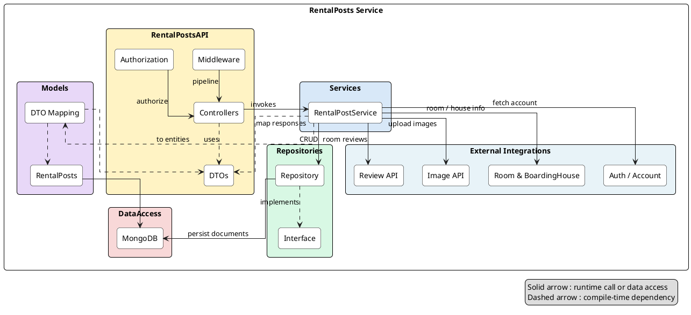

# 1. System Design

## 1.2 Package Diagram – RentalPostsAPI
The `RentalPostsAPI` is organised into layered packages that isolate transport concerns, business logic, persistence, and cross-service integrations. Controllers expose OData/REST endpoints, services coordinate domain rules and external calls, repositories wrap MongoDB access, while AutoMapper profiles and DTOs keep the API contract aligned with the underlying `RentalPosts` document model.

| No | Package | Description |
|----|---------|-------------|
| 01 | `Controllers` | ASP.NET Core controllers exposing REST/OData endpoints for listing, CRUD, and room lookups. |
| 02 | `DTO` | Request/response schemas (e.g., `CreateRentalPostDTO`, `RentalpostDTO`, `ApiResponse`) exchanged with clients and other services. |
| 03 | `Service` | `RentalPostService` orchestrates business rules, applies AutoMapper, enriches posts with external data, and enforces ownership. |
| 04 | `Service.Interface` | Abstractions (`IRentalPostService`, `IExternalService`, `ITokenService`) that decouple controllers and enable dependency injection/testing. |
| 05 | `ExternalService` | Typed `HttpClient` adapters reaching Auth, Room, BoardingHouse, Image, and Review APIs; also handles media uploads. |
| 06 | `TokenService` | Helper extracting user/role claims from JWT tokens to determine ownership and contact data. |
| 07 | `Repository` | MongoDB CRUD operations over the `RentalPosts` collection, including soft-delete and room-post mappings. |
| 08 | `Repository.Interface` | Contract (`IRentalPostRepository`) ensuring persistence layer remains mockable and unit-test friendly. |
| 09 | `Data` | MongoDB infrastructure (`MongoDbService`, `MongoSettings`) initialising the database client and exposing collections. |
| 10 | `Models` | `RentalPosts` document definition mapping C# properties to MongoDB fields with Bson attributes. |
| 11 | `Profiles` | AutoMapper configuration translating between DTOs and `RentalPosts`, ignoring derived fields such as author/house names. |

## 1.3 Package Diagram – BoardingHouseAPI
`BoardingHouseAPI` exposes CRUD and analytics endpoints for boarding houses, handling location validation, media uploads, room/review lookups, and sentiment/rating aggregation. The service coordinates multiple downstream clients (Room, Review, Image, Sentiment, Gateway) while persisting house and location documents in MongoDB collections.

```plantuml
@startuml
skinparam linetype ortho
skinparam rectangle {
  RoundCorner 10
  BackgroundColor White
  BorderColor Black
}
allow_mixing

rectangle "BoardingHouse Service" {
  rectangle "BoardingHouseAPI" as BHApi #FFF3C4 {
    rectangle "Controllers" as BHControllers #FFFFFF
    rectangle "DTO" as BHDto #FFFFFF
    rectangle "Enum" as BHEnum #FFFFFF
  }

  rectangle "Service" as BHServiceBox #D8E8F8 {
    rectangle "BoardingHouseService" as BHService #FFFFFF
  }

  rectangle "Integrations" as BHIntegrationsBox #E8F3F8 {
    rectangle "ImageClientService" as BHImage #FFFFFF
    rectangle "RoomClientService" as BHRoom #FFFFFF
    rectangle "ReviewClientService" as BHReview #FFFFFF
    rectangle "SentimentAnalysisClientService" as BHSentiment #FFFFFF
  }

  rectangle "TokenService" as BHTokenBox #F8F1D8 {
    rectangle "TokenService" as BHToken #FFFFFF
  }

  rectangle "Service.Interface" as BHServiceInterfaceBox #D8F8E4 {
    rectangle "IBoardingHouseService" as IBoardingHouseService #FFFFFF
    rectangle "IImageClientService" as IImageClientService #FFFFFF
    rectangle "IRoomClientService" as IRoomClientService #FFFFFF
    rectangle "IReviewClientService" as IReviewClientService #FFFFFF
    rectangle "ISentimentAnalysisClientService" as ISentimentAnalysisClientService #FFFFFF
    rectangle "ITokenService" as ITokenService #FFFFFF
  }

  rectangle "Repository" as BHRepositoryBox #D8F8E4 {
    rectangle "BoardingHouseRepository" as BHRepository #FFFFFF
  }

  rectangle "Repository.Interface" as BHRepositoryInterfaceBox #D8F8E4 {
    rectangle "IBoardingHouseRepository" as IBoardingHouseRepository #FFFFFF
  }

  rectangle "Data" as BHDataBox #F8D8D8 {
    rectangle "MongoDbService" as BHData #FFFFFF
    rectangle "MongoDB Collections" as BHMongo #FFFFFF
  }

  rectangle "Models" as BHModelsBox #E8D8F8 {
    rectangle "BoardingHouse" as BHModel #FFFFFF
    rectangle "HouseLocation" as BHLocation #FFFFFF
  }

  rectangle "Profiles" as BHProfilesBox #E8D8F8 {
    rectangle "BoardingHouseProfile" as BHProfile #FFFFFF
  }
}

BHControllers --> BHService : calls
BHControllers ..> BHDto : payload
BHControllers ..> BHEnum : filters

BHService --> BHRepository : CRUD
BHService --> BHImage : upload images
BHService --> BHRoom : fetch rooms
BHService --> BHReview : fetch reviews
BHService --> BHSentiment : sentiment
BHService --> BHToken : claims
BHService ..> BHProfile : mapping
BHService ..> IBoardingHouseService
BHService ..> IImageClientService
BHService ..> IRoomClientService
BHService ..> IReviewClientService
BHService ..> ISentimentAnalysisClientService
BHService ..> ITokenService
BHService ..> BHDto
BHService ..> BHEnum

BHRepository ..> IBoardingHouseRepository
BHRepository --> BHData : database access

BHData --> BHMongo
BHRepository ..> BHModel
BHRepository ..> BHLocation

BHProfile ..> BHDto
BHProfile ..> BHModel
BHProfile ..> BHLocation

legend right
  Solid arrow : runtime call or data access
  Dashed arrow : compile-time dependency / mapping
endlegend

@enduml
```

| No | Package | Description |
|----|---------|-------------|
| 01 | `Controllers` | ASP.NET Core controller exposing OData/REST endpoints for boarding house CRUD, ranking, and analytics. |
| 02 | `DTO` | Request/response contracts (create/update DTOs, ranking summaries) plus shared `ApiResponse` wrappers. |
| 03 | `Enum` | Enumerations such as `RankType` that drive ranking and filtering logic. |
| 04 | `Service` | `BoardingHouseService` orchestrates location validation, image uploads, downstream lookups, and Mongo persistence. |
| 05 | `Integrations` | HTTP client adapters calling external services (Room, Review, Image, Sentiment, Gateway metadata). |
| 06 | `TokenService` | Helper extracting user claims/roles from JWT to enforce ownership and permissions. |
| 07 | `Service.Interface` | Abstractions for the core service and integration adapters to support dependency injection and testing. |
| 08 | `Repository` | MongoDB repository managing `BoardingHouse`/`HouseLocation` documents and deduplication checks. |
| 09 | `Repository.Interface` | Contract `IBoardingHouseRepository` decoupling service logic from data access implementation. |
| 10 | `Data` | `MongoDbService` configuring Mongo client and exposing `BoardingHouses`/`HouseLocations` collections. |
| 11 | `Models` | Domain documents representing boarding houses and nested location details (Bson annotated). |
| 12 | `Profiles` | AutoMapper profile mapping between DTOs, models, and location subdocuments. |
